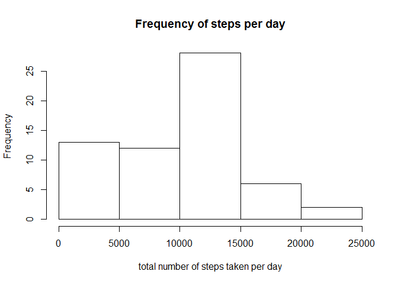
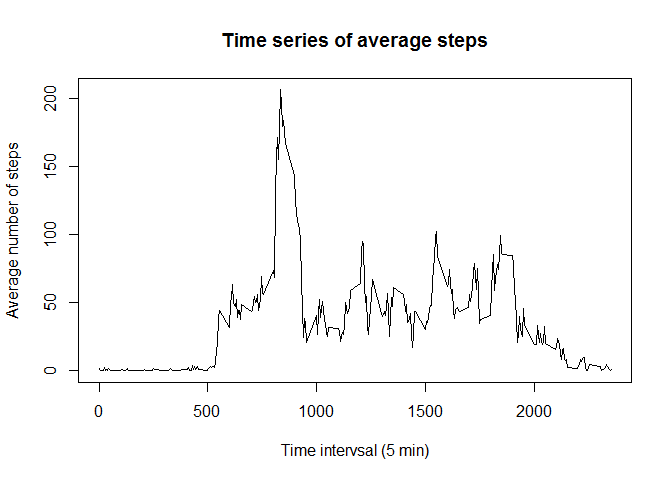
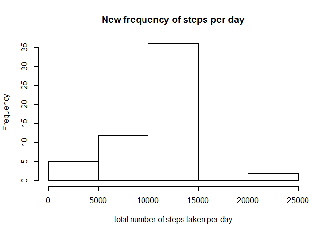

##Title: "RepData_PeerAssessment1"<br />
author: "Zhi Liu"<br />
date: "September 7, 2016"<br />
output: html_document<br />
============================================================================

##Loading and preprocessing the data
1.Load the data (i.e. read.csv())

```r
activity <- read.csv("activity.csv", header = T)
```

## What is mean total number of steps taken per day?
1.Calculate the total number of steps taken per day<br />
2.Make a histogram of the total number of steps taken each day<br />
3.Calculate and report the mean and median of the total number of steps taken per day<br />

```r
spd_sum <- tapply(activity$steps, activity$date, sum, na.rm = T)
spd_sum <- data.frame(spd_sum)
spd_sum
```

```
##            spd_sum
## 2012-10-01       0
## 2012-10-02     126
## 2012-10-03   11352
## 2012-10-04   12116
## 2012-10-05   13294
## 2012-10-06   15420
## 2012-10-07   11015
## 2012-10-08       0
## 2012-10-09   12811
## 2012-10-10    9900
## 2012-10-11   10304
## 2012-10-12   17382
## 2012-10-13   12426
## 2012-10-14   15098
## 2012-10-15   10139
## 2012-10-16   15084
## 2012-10-17   13452
## 2012-10-18   10056
## 2012-10-19   11829
## 2012-10-20   10395
## 2012-10-21    8821
## 2012-10-22   13460
## 2012-10-23    8918
## 2012-10-24    8355
## 2012-10-25    2492
## 2012-10-26    6778
## 2012-10-27   10119
## 2012-10-28   11458
## 2012-10-29    5018
## 2012-10-30    9819
## 2012-10-31   15414
## 2012-11-01       0
## 2012-11-02   10600
## 2012-11-03   10571
## 2012-11-04       0
## 2012-11-05   10439
## 2012-11-06    8334
## 2012-11-07   12883
## 2012-11-08    3219
## 2012-11-09       0
## 2012-11-10       0
## 2012-11-11   12608
## 2012-11-12   10765
## 2012-11-13    7336
## 2012-11-14       0
## 2012-11-15      41
## 2012-11-16    5441
## 2012-11-17   14339
## 2012-11-18   15110
## 2012-11-19    8841
## 2012-11-20    4472
## 2012-11-21   12787
## 2012-11-22   20427
## 2012-11-23   21194
## 2012-11-24   14478
## 2012-11-25   11834
## 2012-11-26   11162
## 2012-11-27   13646
## 2012-11-28   10183
## 2012-11-29    7047
## 2012-11-30       0
```

```r
hist(spd_sum$spd_sum, main = "Frequency of steps per day", xlab = "total number of steps taken per day")
```

<!-- -->

```r
spd_mean <- tapply(activity$steps, activity$date, mean, na.rm = T)
spd_mean <- data.frame(spd_mean)
spd_mean
```

```
##              spd_mean
## 2012-10-01        NaN
## 2012-10-02  0.4375000
## 2012-10-03 39.4166667
## 2012-10-04 42.0694444
## 2012-10-05 46.1597222
## 2012-10-06 53.5416667
## 2012-10-07 38.2465278
## 2012-10-08        NaN
## 2012-10-09 44.4826389
## 2012-10-10 34.3750000
## 2012-10-11 35.7777778
## 2012-10-12 60.3541667
## 2012-10-13 43.1458333
## 2012-10-14 52.4236111
## 2012-10-15 35.2048611
## 2012-10-16 52.3750000
## 2012-10-17 46.7083333
## 2012-10-18 34.9166667
## 2012-10-19 41.0729167
## 2012-10-20 36.0937500
## 2012-10-21 30.6284722
## 2012-10-22 46.7361111
## 2012-10-23 30.9652778
## 2012-10-24 29.0104167
## 2012-10-25  8.6527778
## 2012-10-26 23.5347222
## 2012-10-27 35.1354167
## 2012-10-28 39.7847222
## 2012-10-29 17.4236111
## 2012-10-30 34.0937500
## 2012-10-31 53.5208333
## 2012-11-01        NaN
## 2012-11-02 36.8055556
## 2012-11-03 36.7048611
## 2012-11-04        NaN
## 2012-11-05 36.2465278
## 2012-11-06 28.9375000
## 2012-11-07 44.7326389
## 2012-11-08 11.1770833
## 2012-11-09        NaN
## 2012-11-10        NaN
## 2012-11-11 43.7777778
## 2012-11-12 37.3784722
## 2012-11-13 25.4722222
## 2012-11-14        NaN
## 2012-11-15  0.1423611
## 2012-11-16 18.8923611
## 2012-11-17 49.7881944
## 2012-11-18 52.4652778
## 2012-11-19 30.6979167
## 2012-11-20 15.5277778
## 2012-11-21 44.3993056
## 2012-11-22 70.9270833
## 2012-11-23 73.5902778
## 2012-11-24 50.2708333
## 2012-11-25 41.0902778
## 2012-11-26 38.7569444
## 2012-11-27 47.3819444
## 2012-11-28 35.3576389
## 2012-11-29 24.4687500
## 2012-11-30        NaN
```

```r
spd_median <- tapply(activity$steps, activity$date, median, na.rm = T)
spd_median <- data.frame(spd_median)
spd_median
```

```
##            spd_median
## 2012-10-01         NA
## 2012-10-02          0
## 2012-10-03          0
## 2012-10-04          0
## 2012-10-05          0
## 2012-10-06          0
## 2012-10-07          0
## 2012-10-08         NA
## 2012-10-09          0
## 2012-10-10          0
## 2012-10-11          0
## 2012-10-12          0
## 2012-10-13          0
## 2012-10-14          0
## 2012-10-15          0
## 2012-10-16          0
## 2012-10-17          0
## 2012-10-18          0
## 2012-10-19          0
## 2012-10-20          0
## 2012-10-21          0
## 2012-10-22          0
## 2012-10-23          0
## 2012-10-24          0
## 2012-10-25          0
## 2012-10-26          0
## 2012-10-27          0
## 2012-10-28          0
## 2012-10-29          0
## 2012-10-30          0
## 2012-10-31          0
## 2012-11-01         NA
## 2012-11-02          0
## 2012-11-03          0
## 2012-11-04         NA
## 2012-11-05          0
## 2012-11-06          0
## 2012-11-07          0
## 2012-11-08          0
## 2012-11-09         NA
## 2012-11-10         NA
## 2012-11-11          0
## 2012-11-12          0
## 2012-11-13          0
## 2012-11-14         NA
## 2012-11-15          0
## 2012-11-16          0
## 2012-11-17          0
## 2012-11-18          0
## 2012-11-19          0
## 2012-11-20          0
## 2012-11-21          0
## 2012-11-22          0
## 2012-11-23          0
## 2012-11-24          0
## 2012-11-25          0
## 2012-11-26          0
## 2012-11-27          0
## 2012-11-28          0
## 2012-11-29          0
## 2012-11-30         NA
```

##What is the average daily activity pattern?
1.Make a time series plot (i.e. type = "l") of the 5-minute interval (x-axis) and the average number of steps taken, averaged across all days (y-axis)<br />
2.Which 5-minute interval, on average across all the days in the dataset, contains the maximum number of steps?<br />

```r
sad_mean <- tapply(activity$steps, activity$interval, mean, na.rm = T)
sad_mean <- data.frame(sad_mean)
sad_mean$interval <- rownames(sad_mean)
colnames(sad_mean)[1] <- "average_steps_alldays"
plot(sad_mean$interval, sad_mean$average_steps_alldays, type = "l", main = "Time series of average steps", xlab = "Time intervsal (5 min)", ylab = "Average number of steps")
```

<!-- -->

```r
sad_mean_new <- sad_mean[order(sad_mean$average_steps_alldays, decreasing = T),]
sad_mean_new[1,2]
```

```
## [1] "835"
```

##Imputing missing values
1.Calculate and report the total number of missing values in the dataset<br />
2.Use the mean of 5-minute interval across all days to replace the NAs.<br />
3.Create a new dataset that is equal to the original dataset but with the missing data filled in.<br />
4.Make a histogram of the total number of steps taken each day and Calculate and report the mean and median total number of steps taken per day. Comparing with the previous data with NAs.<br />

```r
sum(is.na(activity$steps))
```

```
## [1] 2304
```

```r
library(dplyr)
```

```
## 
## Attaching package: 'dplyr'
```

```
## The following objects are masked from 'package:stats':
## 
##     filter, lag
```

```
## The following objects are masked from 'package:base':
## 
##     intersect, setdiff, setequal, union
```

```r
activity <- mutate(activity, newsteps=ifelse(!is.na(activity$steps), activity$steps, sad_mean$average_steps_alldays))
spd_sum_new <- tapply(activity$newsteps, activity$date, sum, na.rm = T)
spd_sum_new <- data.frame(spd_sum_new)
hist(spd_sum_new$spd_sum_new, main = "New frequency of steps per day", xlab = "total number of steps taken per day")
```

<!-- -->

```r
spd_mean_new <- tapply(activity$newsteps, activity$date, mean, na.rm = T)
spd_mean_new <- data.frame(spd_mean_new)
spd_mean_new
```

```
##            spd_mean_new
## 2012-10-01   37.3825996
## 2012-10-02    0.4375000
## 2012-10-03   39.4166667
## 2012-10-04   42.0694444
## 2012-10-05   46.1597222
## 2012-10-06   53.5416667
## 2012-10-07   38.2465278
## 2012-10-08   37.3825996
## 2012-10-09   44.4826389
## 2012-10-10   34.3750000
## 2012-10-11   35.7777778
## 2012-10-12   60.3541667
## 2012-10-13   43.1458333
## 2012-10-14   52.4236111
## 2012-10-15   35.2048611
## 2012-10-16   52.3750000
## 2012-10-17   46.7083333
## 2012-10-18   34.9166667
## 2012-10-19   41.0729167
## 2012-10-20   36.0937500
## 2012-10-21   30.6284722
## 2012-10-22   46.7361111
## 2012-10-23   30.9652778
## 2012-10-24   29.0104167
## 2012-10-25    8.6527778
## 2012-10-26   23.5347222
## 2012-10-27   35.1354167
## 2012-10-28   39.7847222
## 2012-10-29   17.4236111
## 2012-10-30   34.0937500
## 2012-10-31   53.5208333
## 2012-11-01   37.3825996
## 2012-11-02   36.8055556
## 2012-11-03   36.7048611
## 2012-11-04   37.3825996
## 2012-11-05   36.2465278
## 2012-11-06   28.9375000
## 2012-11-07   44.7326389
## 2012-11-08   11.1770833
## 2012-11-09   37.3825996
## 2012-11-10   37.3825996
## 2012-11-11   43.7777778
## 2012-11-12   37.3784722
## 2012-11-13   25.4722222
## 2012-11-14   37.3825996
## 2012-11-15    0.1423611
## 2012-11-16   18.8923611
## 2012-11-17   49.7881944
## 2012-11-18   52.4652778
## 2012-11-19   30.6979167
## 2012-11-20   15.5277778
## 2012-11-21   44.3993056
## 2012-11-22   70.9270833
## 2012-11-23   73.5902778
## 2012-11-24   50.2708333
## 2012-11-25   41.0902778
## 2012-11-26   38.7569444
## 2012-11-27   47.3819444
## 2012-11-28   35.3576389
## 2012-11-29   24.4687500
## 2012-11-30   37.3825996
```

```r
spd_median_new <- tapply(activity$newsteps, activity$date, median, na.rm = T)
spd_median_new <- data.frame(spd_median_new)
spd_median_new
```

```
##            spd_median_new
## 2012-10-01       34.11321
## 2012-10-02        0.00000
## 2012-10-03        0.00000
## 2012-10-04        0.00000
## 2012-10-05        0.00000
## 2012-10-06        0.00000
## 2012-10-07        0.00000
## 2012-10-08       34.11321
## 2012-10-09        0.00000
## 2012-10-10        0.00000
## 2012-10-11        0.00000
## 2012-10-12        0.00000
## 2012-10-13        0.00000
## 2012-10-14        0.00000
## 2012-10-15        0.00000
## 2012-10-16        0.00000
## 2012-10-17        0.00000
## 2012-10-18        0.00000
## 2012-10-19        0.00000
## 2012-10-20        0.00000
## 2012-10-21        0.00000
## 2012-10-22        0.00000
## 2012-10-23        0.00000
## 2012-10-24        0.00000
## 2012-10-25        0.00000
## 2012-10-26        0.00000
## 2012-10-27        0.00000
## 2012-10-28        0.00000
## 2012-10-29        0.00000
## 2012-10-30        0.00000
## 2012-10-31        0.00000
## 2012-11-01       34.11321
## 2012-11-02        0.00000
## 2012-11-03        0.00000
## 2012-11-04       34.11321
## 2012-11-05        0.00000
## 2012-11-06        0.00000
## 2012-11-07        0.00000
## 2012-11-08        0.00000
## 2012-11-09       34.11321
## 2012-11-10       34.11321
## 2012-11-11        0.00000
## 2012-11-12        0.00000
## 2012-11-13        0.00000
## 2012-11-14       34.11321
## 2012-11-15        0.00000
## 2012-11-16        0.00000
## 2012-11-17        0.00000
## 2012-11-18        0.00000
## 2012-11-19        0.00000
## 2012-11-20        0.00000
## 2012-11-21        0.00000
## 2012-11-22        0.00000
## 2012-11-23        0.00000
## 2012-11-24        0.00000
## 2012-11-25        0.00000
## 2012-11-26        0.00000
## 2012-11-27        0.00000
## 2012-11-28        0.00000
## 2012-11-29        0.00000
## 2012-11-30       34.11321
```

## Are there differences in activity patterns between weekdays and weekends?
1.Create a new factor variable in the dataset with two levels - "weekday" and "weekend" indicating whether a given date is a weekday or weekend day.<br />
2.Make a panel plot containing a time series plot (i.e. type = "l") of the 5-minute interval (x-axis) and the average number of steps taken, averaged across all weekday days or weekend days (y-axis). <br />

```r
activity$weekday <- weekdays(as.Date(activity$date))
activity$weekday[activity$weekday=="Monday"|activity$weekday=="Tuesday"|activity$weekday=="Wednesday"|activity$weekday=="Thursday"|activity$weekday=="Friday"] <- "weekday"
activity$weekday[activity$weekday=="Saturday"|activity$weekday=="Sunday"] <- "weekend"
library(lattice)
xyplot(activity$newsteps~activity$interval|activity$weekday, type = "l", layout = c(1,2), ylab = "Number of steps", xlab = "Interval")
```

<!-- -->
